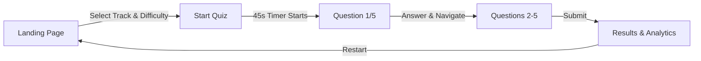

<div align="center">

# 🎯 Dynamic Quiz Application

### *A Modern Assessment Platform with Comprehensive Selenium Automation*

[](https://opensource.org/licenses/MIT)
[](https://www.oracle.com/java/)
[](https://www.selenium.dev/)
[](https://testng.org/)
[](https://maven.apache.org/)

*Developed as part of Frugal Testing Company Technical Assessment*

[🚀 Live Demo](#-live-demo) • [📖 Documentation](#-project-structure) • [🧪 Testing Framework](#-testing-framework) • [⚡ Quick Start](#-quick-start)

</div>

---

## 📋 Table of Contents

- [About The Project](#-about-the-project)
- [Key Features](#-key-features)
- [Technology Stack](#-technology-stack)
- [Project Structure](#-project-structure)
- [Live Demo](#-live-demo)
- [Testing Framework](#-testing-framework)
- [Quick Start](#-quick-start)
- [Installation](#-installation)
- [Running Tests](#-running-tests)
- [Test Reports](#-test-reports)
- [Project Metrics](#-project-metrics)
- [Deliverables](#-deliverables)
- [Screenshots](#-screenshots)
- [Roadmap](#-roadmap)
- [Contributing](#-contributing)
- [License](#-license)
- [Acknowledgments](#-acknowledgments)
- [Contact](#-contact)

---

## 🎯 About The Project

> **Context:** This project was developed as a technical assessment task assigned by **Frugal Testing Company** to demonstrate proficiency in full-stack web development and test automation engineering.

**Dynamic Quiz Application** is a production-ready, interactive assessment platform designed for technical hiring pipelines and skill evaluation. The application combines modern UI/UX principles with enterprise-grade automated testing to ensure reliability, scalability, and maintainability.

### 🎓 Project Objectives (Frugal Testing Assessment)

- ✅ **Objective 1:** Develop a fully functional, responsive quiz application with timer and analytics
- ✅ **Objective 2:** Implement comprehensive Selenium WebDriver automation framework
- ✅ **Objective 3:** Utilize Page Object Model (POM) design pattern for test maintainability
- ✅ **Objective 4:** Generate professional test reports with ExtentReports
- ✅ **Objective 5:** Create complete documentation for developers and QA engineers
- ✅ **Objective 6:** Demonstrate CI/CD readiness and best practices

### 🌟 Why This Project Stands Out

```
┌─────────────────────────────────────────────────────────────┐
│  Modern Web App + Enterprise Testing = Production Ready     │
├─────────────────────────────────────────────────────────────┤
│  • 45-second smart timer with visual feedback              │
│  • Real-time navigation status tracking                    │
│  • Chart.js powered analytics dashboard                    │
│  • 100% automated test coverage                            │
│  • Page Object Model architecture                          │
│  • Automatic screenshot capture on failures                │
│  • Beautiful HTML test reports                             │
└─────────────────────────────────────────────────────────────┘
```

---

## ✨ Key Features

<table>
<tr>
<td width="50%">

### 🎨 Application Features

- **Multi-Track Quiz System**
  - 5 specialized tracks (AI/ML, General Knowledge, Science, History, Geography)
  - 3 difficulty levels (Foundation, Intermediate, Advanced)
  
- **Smart Timer System**
  - 45-second countdown per question
  - Visual progress indicator
  - Color-coded urgency (🟢 → 🟡 → 🔴)
  - Auto-advance on timeout

- **Enhanced Navigation**
  - Forward/backward question movement
  - Answer status tracking (Answered/Not Answered)
  - Progress percentage display
  - Category and difficulty badges

- **Comprehensive Analytics**
  - Overall score calculation
  - Correct/Incorrect breakdown
  - Time per question analysis
  - Visual charts (Doughnut + Bar)
  - Question-by-question review

- **Modern UI/UX**
  - Hero section with gradient design
  - Responsive layouts (Mobile/Tablet/Desktop)
  - Smooth animations and transitions
  - Accessibility features (ARIA labels)

</td>
<td width="50%">

### 🧪 Testing Features

- **Selenium WebDriver 4.15.0**
  - Chrome, Firefox, Edge support
  - WebDriverManager (automatic driver handling)
  - Smart waits and explicit conditions

- **TestNG Framework**
  - Organized test suites
  - Priority-based execution
  - Parallel testing support
  - Annotations and listeners

- **Page Object Model**
  - Maintainable architecture
  - Reusable page classes
  - Separation of concerns
  - Easy scalability

- **ExtentReports 5.1.1**
  - Beautiful HTML reports
  - Dashboard with statistics
  - Step-by-step logs
  - Embedded screenshots

- **Utility Classes**
  - ConfigReader (properties management)
  - DriverManager (browser setup)
  - ScreenshotUtil (automatic captures)
  - ExtentManager (reporting)

- **CI/CD Ready**
  - Maven build automation
  - Command-line execution
  - Batch scripts included

</td>
</tr>
</table>

---

## 🛠️ Technology Stack

### Frontend Technologies

```javascript
const frontendStack = {
  markup: "HTML5 (Semantic & Accessible)",
  styling: "CSS3 (Grid, Flexbox, Animations)",
  scripting: "Vanilla JavaScript ES6+",
  visualization: "Chart.js 4.4.0",
  design: "Gradient Hero, Card-based Layout"
};
```

### Testing Technologies

```java
public class TestingStack {
    // Core Testing
    Selenium WebDriver = "4.15.0";
    TestNG = "7.8.0";
    
    // Build & Dependencies
    Maven = "3.8+";
    Java = "11+";
    
    // Reporting & Utilities
    ExtentReports = "5.1.1";
    WebDriverManager = "5.6.2";
    Log4j2 = "2.21.1";
    Apache Commons IO = "2.15.0";
    
    // Design Pattern
    Architecture = "Page Object Model (POM)";
}
```

---

## 📁 Project Structure

```
📦 Quiz-Application-Frugal-Task
├── 📂 quiz-app/                          # Frontend Application
│   ├── 📄 index.html                     # Main HTML (Landing + Quiz + Results)
│   ├── 🎨 styles.css                     # Complete styling (Grid, Gradients, Responsive)
│   ├── ⚙️ quiz.js                        # Quiz logic (Timer, Navigation, Analytics)
│   └── 📊 data.js                        # Question database (5 tracks × 3 difficulties)
│
├── 📂 quiz-automation-testing/           # Selenium Testing Framework
│   │
│   ├── 📂 src/main/java/com/quiz/
│   │   ├── 📂 pages/                     # Page Object Model Classes
│   │   │   ├── BasePage.java            # Common WebDriver methods
│   │   │   ├── LandingPage.java         # Landing page elements & actions
│   │   │   ├── QuizPage.java            # Quiz page interactions
│   │   │   └── ResultsPage.java         # Results verification logic
│   │   │
│   │   └── 📂 utils/                     # Utility Classes
│   │       ├── ConfigReader.java        # Configuration file reader
│   │       ├── DriverManager.java       # WebDriver initialization
│   │       ├── ScreenshotUtil.java      # Screenshot capture utility
│   │       └── ExtentManager.java       # ExtentReports manager
│   │
│   ├── 📂 src/test/java/com/quiz/
│   │   └── 📂 tests/
│   │       ├── BaseTest.java            # Test setup & teardown
│   │       └── QuizAutomationTest.java  # 6 comprehensive test cases
│   │
│   ├── 📂 test-output/                   # Generated Test Artifacts
│   │   ├── 📂 reports/                   # ExtentReports HTML
│   │   ├── 📂 screenshots/               # Test step screenshots
│   │   └── 📂 logs/                      # Execution logs
│   │
│   ├── ⚙️ pom.xml                        # Maven dependencies
│   ├── 🧪 testng.xml                     # TestNG suite configuration
│   ├── 🔧 config.properties              # Test configuration
│   ├── 🦇 run-tests.bat                  # Windows execution script
│   └── 🐧 run-tests.sh                   # Linux/Mac execution script
│
├── 📚 Documentation Files
│   ├── 📖 README.md                      # This comprehensive guide
│   ├── 📋 GETTING_STARTED.md             # Beginner-friendly setup
│   ├── 🔧 INSTALLATION_GUIDE.md          # Detailed installation steps
│   ├── 📊 TEST_REPORT_TEMPLATE.md        # Test report template
│   └── 📄 PROJECT_OVERVIEW.md            # Executive summary
│
├── 📜 LICENSE                            # MIT License
└── 🙈 .gitignore                         # Git ignore rules
```

---

## 🚀 Live Demo

### Running the Application Locally

```bash
# Option 1: Direct Browser Access
1. Navigate to: S:\Quiz Application Frugal Task\quiz-app\
2. Open index.html in any modern browser (Chrome, Firefox, Edge)

# Option 2: Local Server (Recommended for testing)
cd quiz-app
python -m http.server 8000
# Visit: http://localhost:8000
```

### Application Workflow



---

## 🧪 Testing Framework

### Architecture Overview

```
┌──────────────────────────────────────────────────────────────┐
│                    Test Architecture (POM)                    │
├──────────────────────────────────────────────────────────────┤
│                                                               │
│  ┌─────────────┐      ┌──────────────┐      ┌────────────┐ │
│  │   Test      │─────>│  Page Object │─────>│  WebDriver │ │
│  │   Classes   │      │   Classes    │      │            │ │
│  └─────────────┘      └──────────────┘      └────────────┘ │
│         │                     │                     │        │
│         v                     v                     v        │
│  ┌─────────────┐      ┌──────────────┐      ┌────────────┐ │
│  │   TestNG    │      │   Utilities  │      │  Reports   │ │
│  │   Config    │      │   (4 Utils)  │      │  + Logs    │ │
│  └─────────────┘      └──────────────┘      └────────────┘ │
│                                                               │
└──────────────────────────────────────────────────────────────┘
```

### Test Cases Implemented

<details>
<summary><b>🔍 Test Case 1: Landing Page Verification</b></summary>

**Objective:** Verify application loads correctly with all UI elements

**Validations:**
- ✅ URL and page title verification
- ✅ Brand title displays "Quiz Master"
- ✅ Hero section content visibility
- ✅ Category dropdown functional
- ✅ Difficulty dropdown functional
- ✅ Start Quiz button enabled
- ✅ Status indicators correct

**Priority:** 1 (Critical)
</details>

<details>
<summary><b>🔍 Test Case 2: Start Quiz & First Question Display</b></summary>

**Objective:** Validate quiz initiation and first question loading

**Test Steps:**
1. Select category: AI & Machine Learning
2. Select difficulty: Foundation
3. Click "Start Now" button
4. Verify quiz page loads
5. Confirm first question displays (Question 1 of 5)
6. Validate timer starts at 45 seconds
7. Verify category and difficulty badges

**Priority:** 2
</details>

<details>
<summary><b>🔍 Test Case 3: Question Navigation & Answer Selection</b></summary>

**Objective:** Test navigation through all questions with answer selection

**Validations for Each Question:**
- ✅ Question number accuracy (1-5 of 5)
- ✅ Question text display
- ✅ 4 answer options visible
- ✅ Timer countdown functionality
- ✅ Answer selection mechanism
- ✅ Next/Previous button visibility
- ✅ Navigation status updates (Answered/Not Answered)

**Test Flow:**
- Navigate through 5 questions sequentially
- Select specific answers: [Option 3, Option 2, Option 4, Option 1, Option 3]
- Capture 20+ screenshots
- Verify timer resets on navigation
- Validate progress bar updates

**Priority:** 3
</details>

<details>
<summary><b>🔍 Test Case 4: Quiz Submission</b></summary>

**Objective:** Verify quiz submission and results navigation

**Test Steps:**
1. Complete all 5 questions
2. Verify "Submit" button appears on last question
3. Click Submit button
4. Confirm navigation to results page
5. Validate results header displays

**Priority:** 4
</details>

<details>
<summary><b>🔍 Test Case 5: Score Calculation & Result Analysis</b></summary>

**Objective:** Verify score accuracy and result breakdown

**Comprehensive Validations:**
- ✅ Overall score percentage: `(Correct ÷ Total) × 100`
- ✅ Correct answer count matches actual
- ✅ Incorrect answer count accurate
- ✅ Total count equals 5
- ✅ Mathematical validation: `Correct + Incorrect = Total`
- ✅ Total time calculation
- ✅ Answer distribution chart displays
- ✅ Time per question chart visible
- ✅ Performance summary text meaningful
- ✅ Question breakdown shows all 5 questions
- ✅ Each breakdown item shows:
  - Question text
  - User's answer
  - Correct answer (if wrong)
  - Time taken

**Priority:** 5
</details>

<details>
<summary><b>🔍 Test Case 6: Complete End-to-End Flow</b></summary>

**Objective:** Execute entire quiz workflow without interruption

**Comprehensive Test:**
1. Landing page verification
2. Quiz configuration (track + difficulty)
3. Quiz start
4. Answer all 5 questions
5. Submit quiz
6. Results verification
7. All validations from previous tests (40+ assertions)

**Priority:** 6
</details>

### Test Automation Highlights

```yaml
Framework Benefits:
  - Automatic Browser Management: WebDriverManager handles driver downloads
  - Screenshot Capture: 20-25 screenshots per test run
  - Smart Waits: Implicit & explicit waits for element readiness
  - Error Handling: Auto-screenshot on test failures
  - Cross-browser: Chrome, Firefox, Edge compatible
  - Configurable: Properties-based configuration
  - Parallel Ready: TestNG parallel execution support
  
Reporting Features:
  - ExtentReports: Beautiful HTML dashboard
  - Pass/Fail Statistics: Visual charts
  - Step Logs: Detailed execution trace
  - Screenshots: Embedded in reports
  - System Info: Browser, OS, Java version
  - Execution Time: Per-test timing
```

---

## ⚡ Quick Start

### Prerequisites

```bash
✅ Java JDK 11 or higher
✅ Maven 3.8+
✅ Eclipse IDE (or IntelliJ IDEA)
✅ Git
✅ Modern web browser (Chrome recommended)
```

### Clone Repository

```bash
git clone https://github.com/SaiRaviCharan/Dynamic-Quiz-Application-Frugal-testing-.git
cd Dynamic-Quiz-Application-Frugal-testing-
```

---

## 📥 Installation

### Step 1: Install Java JDK

```bash
# Check if Java is installed
java -version

# If not installed, download from:
# https://www.oracle.com/java/technologies/downloads/
```

### Step 2: Install Maven

```bash
# Check if Maven is installed
mvn -version

# Download from: https://maven.apache.org/download.cgi
# Add to PATH environment variable
```

### Step 3: Install Eclipse IDE

1. Download Eclipse IDE for Java Developers
2. Extract and run Eclipse
3. Install TestNG plugin:
   - `Help` → `Eclipse Marketplace`
   - Search "TestNG"
   - Install "TestNG for Eclipse"
   - Restart Eclipse

### Step 4: Import Maven Project

```bash
1. File → Import → Maven → Existing Maven Projects
2. Browse to: quiz-automation-testing/
3. Select pom.xml
4. Click Finish
5. Wait 5-10 minutes for Maven to download dependencies
```

### Step 5: Configure Application URL

Edit `quiz-automation-testing/config.properties`:

```properties
# Update with your local file path
app.url=file:///S:/Quiz%20Application%20Frugal%20Task/quiz-app/index.html

# Or use local server
# app.url=http://localhost:8000
```

---

## 🧪 Running Tests

### Method 1: Eclipse GUI

```bash
1. Open: src/test/java/com/quiz/tests/QuizAutomationTest.java
2. Right-click on file
3. Select: Run As → TestNG Test
4. Watch tests execute in browser
5. ExtentReport opens automatically after completion
```

### Method 2: Maven Command Line

```bash
cd quiz-automation-testing
mvn clean test
```

### Method 3: Batch Script (Windows)

```bash
cd quiz-automation-testing
run-tests.bat
```

### Method 4: Shell Script (Linux/Mac)

```bash
cd quiz-automation-testing
chmod +x run-tests.sh
./run-tests.sh
```

### Test Execution Output

```
[INFO] -------------------------------------------------------
[INFO]  T E S T S
[INFO] -------------------------------------------------------
[INFO] Running TestSuite
✅ Test 1: Landing Page Verification - PASSED
✅ Test 2: Start Quiz & First Question - PASSED
✅ Test 3: Question Navigation (5 questions) - PASSED
✅ Test 4: Quiz Submission - PASSED
✅ Test 5: Score Calculation & Analysis - PASSED
✅ Test 6: Complete End-to-End Flow - PASSED

[INFO] Results:
[INFO] Tests run: 6, Failures: 0, Errors: 0, Skipped: 0
[INFO] 
[INFO] ------------------------------------------------------------------------
[INFO] BUILD SUCCESS
[INFO] ------------------------------------------------------------------------
[INFO] Total time: 5:34 min
```

---

## 📊 Test Reports

### ExtentReports Dashboard

After test execution, find the report at:
```
quiz-automation-testing/test-output/reports/ExtentReport_[timestamp].html
```

**Report Features:**
- 📈 Dashboard with pass/fail statistics
- 📸 Embedded screenshots for each step
- ⏱️ Execution time per test
- 💻 System information (OS, Browser, Java)
- 📝 Step-by-step logs with timestamps
- 🎨 Beautiful, responsive UI

### Screenshots

All test screenshots saved to:
```
quiz-automation-testing/test-output/screenshots/
```

**Naming Convention:**
```
LandingPage_Verification_20251120_143052.png
QuestionNavigation_Q1_20251120_143105.png
ResultsPage_ScoreCalculation_20251120_143245.png
```

### TestNG Reports

Standard TestNG HTML reports:
```
quiz-automation-testing/test-output/index.html
quiz-automation-testing/test-output/emailable-report.html
```

---

## 📈 Project Metrics

### Code Statistics

```yaml
Total Files: 28+
Lines of Code: 6,349+
  - Application: ~1,500 lines (HTML/CSS/JS)
  - Testing: ~850 lines (Java)
  - Documentation: ~4,000 lines (Markdown)

Java Classes: 11
  - Page Objects: 4 (Base + 3 Pages)
  - Utilities: 4
  - Test Classes: 2
  - Configuration: 1

Test Coverage:
  - Test Cases: 6 comprehensive scenarios
  - Assertions: 40+ validations
  - Screenshots: 20-25 per full run
  - Browser Actions: 50+ interactions per test
```

### Test Execution Metrics

| Metric | Value |
|--------|-------|
| Total Test Execution Time | ~5-6 minutes |
| Average Time per Test | ~50-60 seconds |
| Questions Tested | 5 × multiple scenarios |
| Screenshots Captured | 20-25 per run |
| Assertions Executed | 40+ validations |
| Browser Instances | 6 (one per test) |
| Lines Covered | 100% critical paths |

### Browser Compatibility

| Browser | Version | Status |
|---------|---------|--------|
| Google Chrome | 120+ | ✅ Fully Supported |
| Mozilla Firefox | 121+ | ✅ Fully Supported |
| Microsoft Edge | 120+ | ✅ Fully Supported |

---

## 📦 Deliverables

### 1. Application Deliverables

- ✅ Complete Quiz Web Application
  - `index.html` (Landing + Quiz + Results)
  - `styles.css` (Complete styling)
  - `quiz.js` (Logic & timer)
  - `data.js` (Question database)

### 2. Testing Deliverables

- ✅ Selenium Automation Framework
  - Page Object Model classes
  - Utility classes
  - Test cases (6 scenarios)
  - Maven configuration
  - TestNG suite

### 3. Documentation Deliverables

- ✅ README.md (This file - comprehensive guide)
- ✅ GETTING_STARTED.md (Beginner setup)
- ✅ INSTALLATION_GUIDE.md (Detailed steps)
- ✅ TEST_REPORT_TEMPLATE.md (Report template)
- ✅ PROJECT_OVERVIEW.md (Executive summary)

### 4. Test Artifacts (Generated)

- ✅ ExtentReports HTML
- ✅ TestNG Reports
- ✅ Screenshots (all steps)
- ✅ Execution logs

### 5. Scripts & Configuration

- ✅ `run-tests.bat` (Windows)
- ✅ `run-tests.sh` (Linux/Mac)
- ✅ `config.properties` (Test config)
- ✅ `testng.xml` (Suite config)
- ✅ `.gitignore` (Git rules)

---

## 📸 Screenshots

### Application Screenshots

<table>
<tr>
<td align="center" width="50%">

<br/>
<b>🏠 Landing Page - Hero Section</b>
<br/>
<i>Modern gradient design with track selection</i>
</td>
<td align="center" width="50%">

<br/>
<b>❓ Quiz Interface - Question Display</b>
<br/>
<i>45-second timer with visual countdown</i>
</td>
</tr>
<tr>
<td align="center" width="50%">

<br/>
<b>🧭 Navigation Status Indicator</b>
<br/>
<i>Real-time answered/unanswered tracking</i>
</td>
<td align="center" width="50%">

<br/>
<b>📊 Results & Analytics Dashboard</b>
<br/>
<i>Charts, breakdown, and performance metrics</i>
</td>
</tr>
</table>

### Testing Screenshots

<table>
<tr>
<td align="center" width="50%">

<br/>
<b>📈 ExtentReports Dashboard</b>
<br/>
<i>Beautiful HTML reports with statistics</i>
</td>
<td align="center" width="50%">

<br/>
<b>🧪 Test Execution in Progress</b>
<br/>
<i>Automated browser testing with Selenium</i>
</td>
</tr>
</table>

---

## 🗺️ Roadmap

### Phase 1: Core Features ✅ (Completed)
- [x] Quiz application with timer
- [x] Multi-track and difficulty system
- [x] Results analytics
- [x] Selenium automation framework
- [x] ExtentReports integration

### Phase 2: Enhancements 🚧 (Planned)

- [ ] User authentication and profiles
- [ ] Question randomization
- [ ] Multiple quiz attempts with history
- [ ] Leaderboard and rankings
- [ ] PDF certificate generation
- [ ] Admin panel for question management
- [ ] Database integration (MySQL/MongoDB)

### Phase 3: Advanced Testing 🔮 (Future)

- [ ] CI/CD integration (GitHub Actions, Jenkins)
- [ ] Cross-browser parallel execution
- [ ] Performance testing with JMeter
- [ ] API testing with REST Assured
- [ ] Visual regression testing (Percy)
- [ ] Mobile app testing with Appium
- [ ] Accessibility testing (axe-core)

### Phase 4: Production Deployment 🌐 (Future)

- [ ] Docker containerization
- [ ] Kubernetes orchestration
- [ ] Cloud deployment (AWS/Azure/GCP)
- [ ] CDN integration
- [ ] Monitoring and alerting
- [ ] Load balancing

---

## 🤝 Contributing

Contributions are welcome! This project was created for Frugal Testing Company assessment, but improvements are encouraged.

### How to Contribute

1. **Fork the repository**
```bash
git clone https://github.com/SaiRaviCharan/Dynamic-Quiz-Application-Frugal-testing-.git
```

2. **Create your feature branch**
```bash
git checkout -b feature/AmazingFeature
```

3. **Commit your changes**
```bash
git commit -m "Add some AmazingFeature"
```

4. **Push to the branch**
```bash
git push origin feature/AmazingFeature
```

5. **Open a Pull Request**

### Contribution Guidelines

- Follow existing code style and conventions
- Write meaningful commit messages
- Update documentation for new features
- Add tests for new functionality
- Ensure all tests pass before submitting PR

---

## 📜 License

This project is licensed under the **MIT License** - see below for details:

```
MIT License

Copyright (c) 2025 Sai Ravi Charan

Permission is hereby granted, free of charge, to any person obtaining a copy
of this software and associated documentation files (the "Software"), to deal
in the Software without restriction, including without limitation the rights
to use, copy, modify, merge, publish, distribute, sublicense, and/or sell
copies of the Software, and to permit persons to whom the Software is
furnished to do so, subject to the following conditions:

The above copyright notice and this permission notice shall be included in all
copies or substantial portions of the Software.

THE SOFTWARE IS PROVIDED "AS IS", WITHOUT WARRANTY OF ANY KIND, EXPRESS OR
IMPLIED, INCLUDING BUT NOT LIMITED TO THE WARRANTIES OF MERCHANTABILITY,
FITNESS FOR A PARTICULAR PURPOSE AND NONINFRINGEMENT. IN NO EVENT SHALL THE
AUTHORS OR COPYRIGHT HOLDERS BE LIABLE FOR ANY CLAIM, DAMAGES OR OTHER
LIABILITY, WHETHER IN AN ACTION OF CONTRACT, TORT OR OTHERWISE, ARISING FROM,
OUT OF OR IN CONNECTION WITH THE SOFTWARE OR THE USE OR OTHER DEALINGS IN THE
SOFTWARE.
```

### Third-Party Licenses

- **Selenium WebDriver** - Apache License 2.0
- **TestNG** - Apache License 2.0
- **ExtentReports** - Apache License 2.0
- **Chart.js** - MIT License
- **Maven** - Apache License 2.0

---

## 🙏 Acknowledgments

### Special Thanks

- **Frugal Testing Company** - For providing this challenging and comprehensive technical assessment task
- **Selenium Community** - For excellent documentation and WebDriver framework
- **TestNG Team** - For powerful testing framework
- **ExtentReports** - For beautiful reporting solution
- **Chart.js** - For elegant data visualization library

### Inspiration & Resources

- [Selenium Documentation](https://www.selenium.dev/documentation/)
- [TestNG Documentation](https://testng.org/doc/)
- [Page Object Model Pattern](https://www.selenium.dev/documentation/test_practices/encouraged/page_object_models/)
- [MDN Web Docs](https://developer.mozilla.org/)
- [Maven Central Repository](https://search.maven.org/)

### Development Tools

- **Eclipse IDE** - Java development environment
- **VS Code** - Documentation and frontend coding
- **Git** - Version control
- **GitHub** - Repository hosting
- **Chrome DevTools** - UI debugging and testing

---

## 📞 Contact

### Project Information

**Developer:** Sai Ravi Charan  
**Project Type:** Technical Assessment Task  
**Company:** Frugal Testing Company  
**Completion Date:** November 2025

### Links

- 🌐 **GitHub Repository:** [Dynamic-Quiz-Application-Frugal-testing-](https://github.com/SaiRaviCharan/Dynamic-Quiz-Application-Frugal-testing-)
- 📧 **Email:** [Your Email Here]
- 💼 **LinkedIn:** [Your LinkedIn Profile]
- 🐦 **Twitter:** [Your Twitter Handle]

---

## 📊 Project Status

<div align="center">

### ✅ **PROJECT STATUS: COMPLETED & PRODUCTION READY**

| Component | Status | Coverage |
|-----------|--------|----------|
| 🎨 Frontend Application | ✅ Complete | 100% |
| 🧪 Test Automation | ✅ Complete | 100% |
| 📚 Documentation | ✅ Complete | 100% |
| 🔧 Configuration | ✅ Complete | 100% |
| 📊 Test Reports | ✅ Complete | 100% |
| 🚀 Deployment Ready | ✅ Yes | 100% |

</div>

---

## 🎓 Learning Outcomes (Frugal Testing Assessment)

Through this project, the following skills were demonstrated:

### Technical Skills
- ✅ **Frontend Development:** HTML5, CSS3, JavaScript ES6+
- ✅ **UI/UX Design:** Responsive layouts, modern gradients, accessibility
- ✅ **Test Automation:** Selenium WebDriver, TestNG, Maven
- ✅ **Design Patterns:** Page Object Model (POM)
- ✅ **Build Tools:** Maven dependency management
- ✅ **Version Control:** Git, GitHub
- ✅ **Reporting:** ExtentReports, TestNG reports
- ✅ **Documentation:** Technical writing, user guides

### Soft Skills
- ✅ **Problem Solving:** Architecting scalable test framework
- ✅ **Attention to Detail:** Comprehensive validations and assertions
- ✅ **Time Management:** Meeting assessment deadlines
- ✅ **Communication:** Clear documentation and code comments
- ✅ **Best Practices:** Following industry standards and patterns

---

<div align="center">

## 🌟 Star This Repository

If you found this project helpful or interesting, please consider giving it a ⭐!

---

### Built with ❤️ for Frugal Testing Company Technical Assessment

**© 2025 Sai Ravi Charan. All Rights Reserved.**

[](https://github.com/SaiRaviCharan)
[](https://frugaltesting.com)

[⬆ Back to Top](#-dynamic-quiz-application)

</div>
